## Networking Topics

### What happens when we make a request to: `https://www.google.com`

### First let's learn what is URL?

- URL -> Uniform Resource Locater
- different parts of a url is shown below image

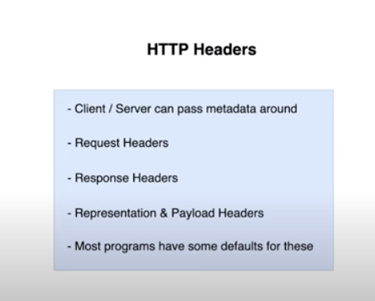

### DNS

- DNS -> Domain Name System

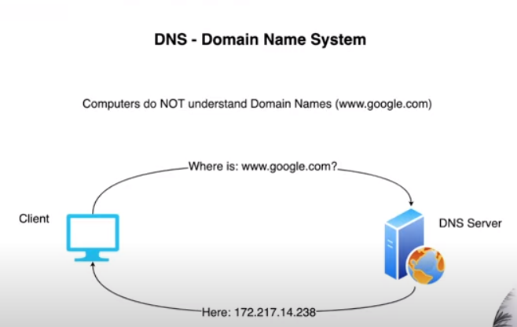

#### IP Address

- IP -> Internet Protocol

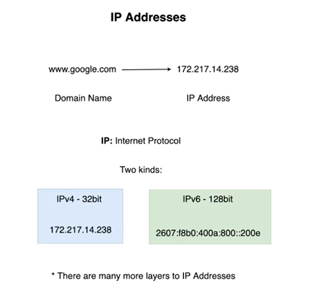

### Network Ports

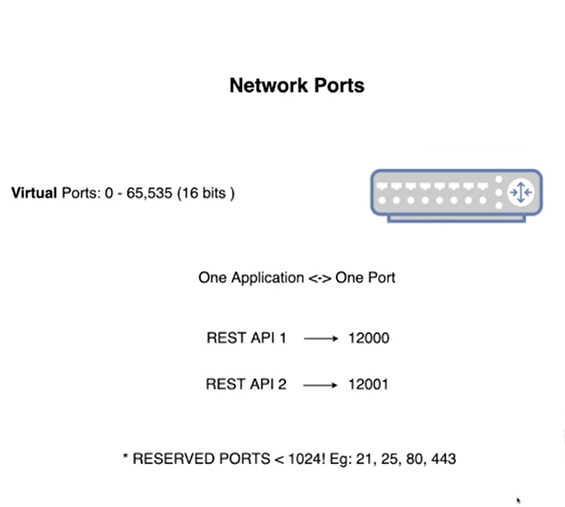

---

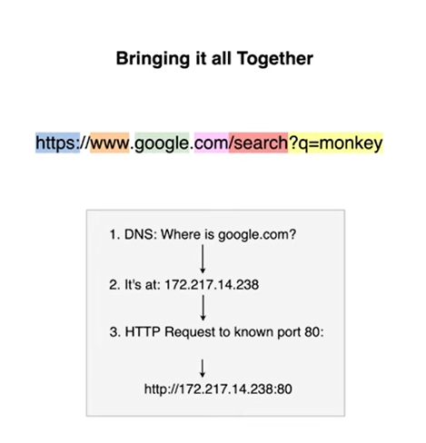

### Network Protocols: Rules of communication(across networks)

- HTTP/HTTPS
- TCP/UDP
- IP
- ...many more

#### OSI Model

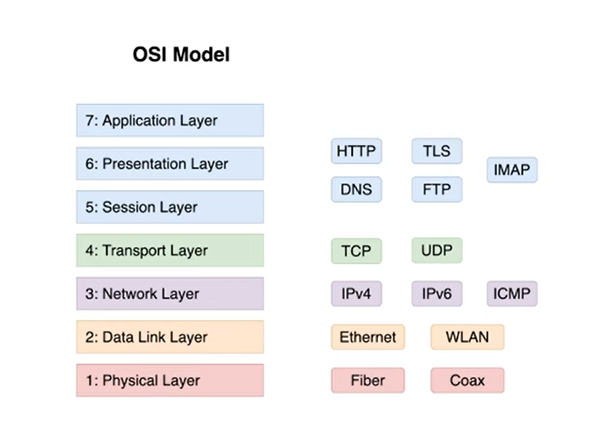

#### HTTP 1.1

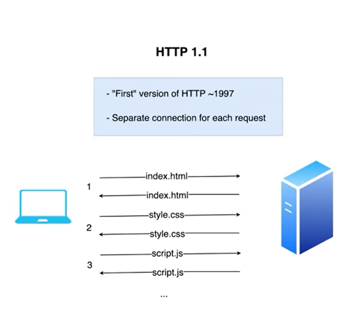

#### HTTP 2

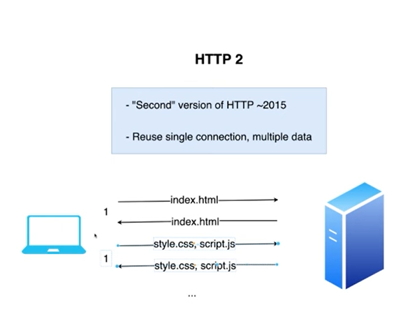

#### Basic HTTP Headers

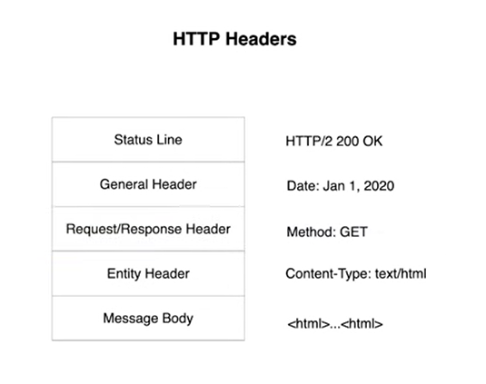

#### HTTPS: Secure version of HTTP

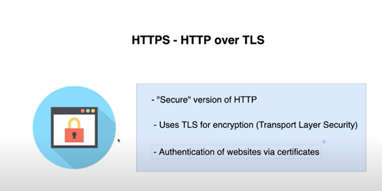

#### TCP: Transmission Control Protocol

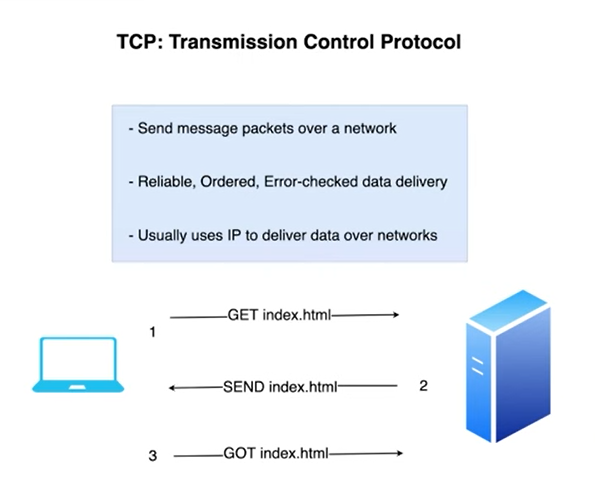

#### TCP Headers

#### UDP: User Diagram Protocol, alternative to tcp

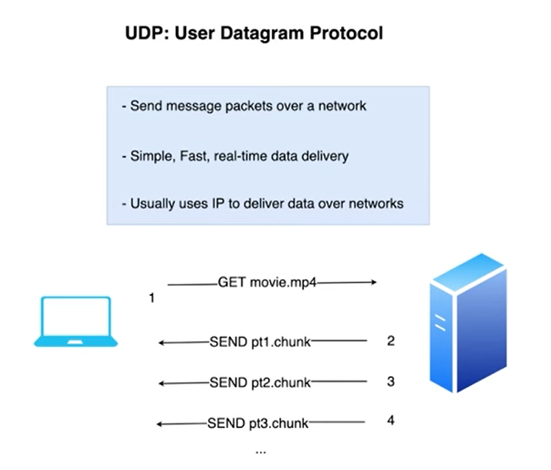

#### UDP Headers

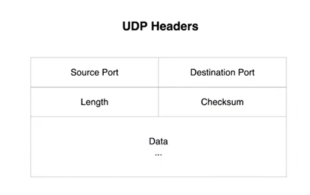

#### IP: Internet Protocol

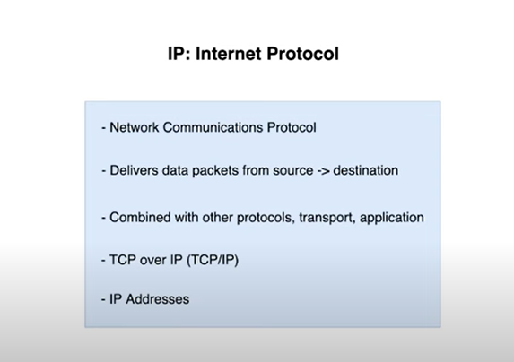

#### IP Headers

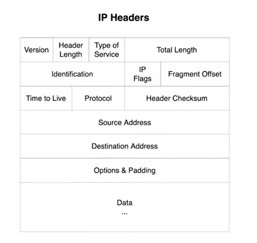
